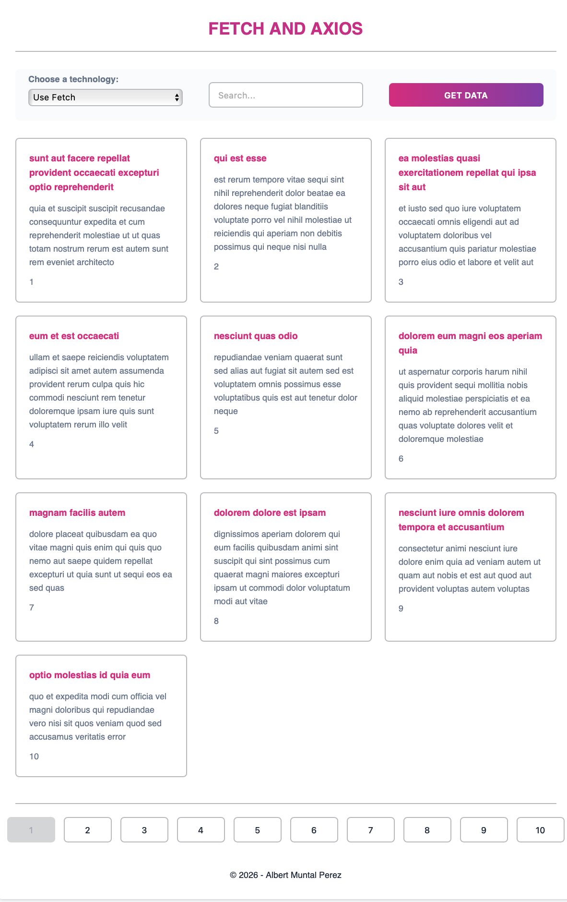

# API-CONSUMER-APP

Small front-end demo that consumes APIs and demonstrates pagination logic and different data-fetching approaches (Fetch API and Axios). Built with vanilla JavaScript, Vite for local development and Vitest for testing.

 

 ## Prerequisites
 - Node.js (v16+ recommended)
 - npm

 ## Install
 Run:

 ```bash
 npm install
 ```

 ## Available scripts
 - `npm run dev` — Start the Vite dev server
 - `npm run build` — Build production assets with Vite
 - `npm run preview` — Preview the built production bundle
 - `npm run test` — Run unit tests with Vitest

 ## Development
 Start the dev server and open the app in your browser (Vite defaults to http://localhost:5173):

 ```bash
 npm run dev
 ```

 Run tests:

 ```bash
 npm run test
 ```

 Build for production:

 ```bash
 npm run build
 npm run preview
 ```

 ## Project structure
 - `index.html` — App entry HTML
 - `main.js` — App bootstrap
 - `package.json` — Project metadata and scripts
 - `styles/styles.css` — Global styles
 - `src/` — Application source files
   - `calculate-Pagination.js` — Pagination calculation helpers
   - `display-results.js` — DOM rendering of results
   - `fetch-data.js` — Shared abstractions for fetching data
   - `fetch-data-fetch.js` — Implementation using Fetch API
   - `fetch-data-axios.js` — Implementation using Axios
   - `setup-pagination.js` — Wire up pagination UI and events
   - `status-functions.js` — Status and UI helper functions
   - `variables-and-consts.js` — Shared constants
 - `src/test/` — Tests
   - `calculate-Pagination.test.js` — Unit tests for pagination logic

 ## Notes
 - Axios is included as a dependency; the repository also contains a pure Fetch implementation for comparison.
 - Tests are small and focused on pagination calculation.

## License & Credits

Developed by:

Albert Muntal Perez

Linkedin: https://www.linkedin.com/in/albert-muntal-perez-a626a0120/

GitHub: https://github.com/DrMunty
